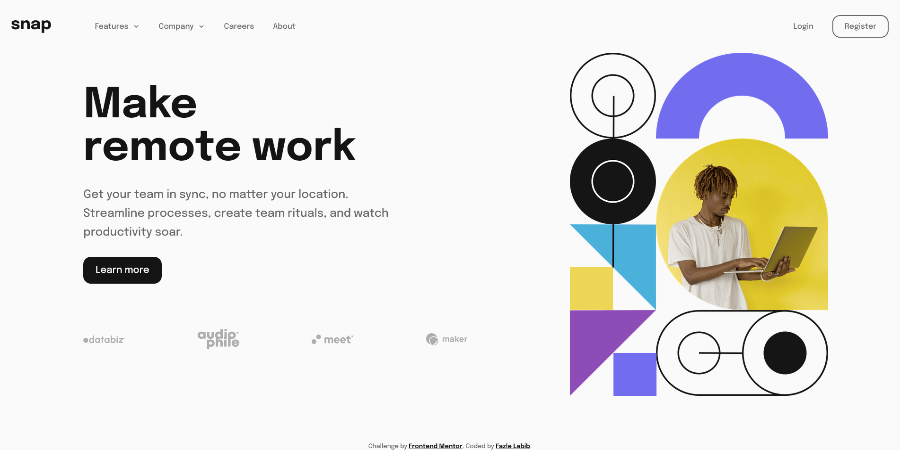

# Frontend Mentor - Intro section with dropdown navigation solution

This is a solution to the [Intro section with dropdown navigation challenge on Frontend Mentor](https://www.frontendmentor.io/challenges/intro-section-with-dropdown-navigation-ryaPetHE5). Frontend Mentor challenges help you improve your coding skills by building realistic projects. 

## Table of contents

- [Overview](#overview)
  - [The challenge](#the-challenge)
  - [Screenshot](#screenshot)
  - [Links](#links)
- [My process](#my-process)
  - [Built with](#built-with)
  - [What I learned](#what-i-learned)
  - [Useful resources](#useful-resources)
- [Author](#author)

## Overview

### The challenge

Users should be able to:

- View the relevant dropdown menus on desktop and mobile when interacting with the navigation links
- View the optimal layout for the content depending on their device's screen size
- See hover states for all interactive elements on the page

### Screenshot




### Links

- Solution URL: [Solution](https://github.com/FazleLabib/frontend-mentor-intro-section-with-dropdown-navigation)
- Live Site URL: [Live Site](https://fazlelabib.github.io/frontend-mentor-intro-section-with-dropdown-navigation)

## My process

### Built with

- Semantic HTML5 markup
- CSS custom properties
- Flexbox
- Mobile-first workflow
- JavaScript

### What I learned

Learned how to make drop-down menus, mobile nav-menus.

<!-- ```html
<h1>Some HTML code I'm proud of</h1>
```
```css
.proud-of-this-css {
  color: papayawhip;
}
```
```js
const proudOfThisFunc = () => {
  console.log('🎉')
}
``` -->

### Useful resources

- [Drop Down Menu](https://www.w3schools.com/howto/howto_css_dropdown.asp) - Modified this to create the drop down menu for my solution
- [Curtain Menu](https://www.w3schools.com/howto/howto_js_curtain_menu.asp) - Modified this to create the mobile navigation menu.

## Author

- Frontend Mentor - [@FazleLabib](https://www.frontendmentor.io/profile/FazleLabib)
